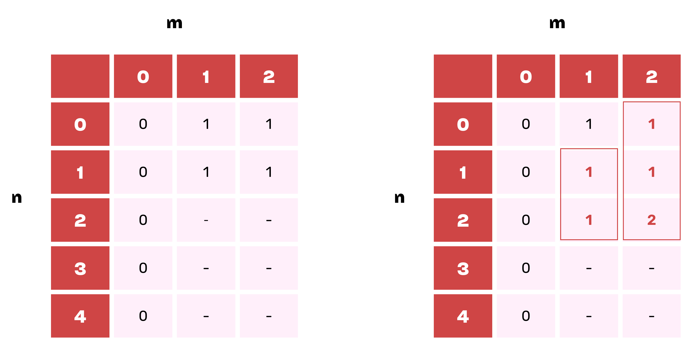
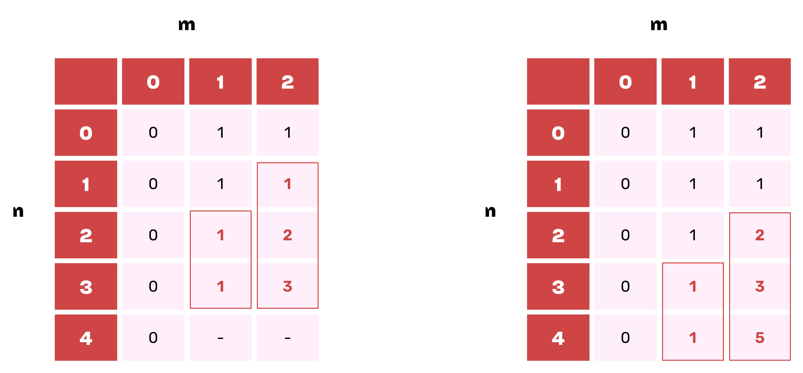
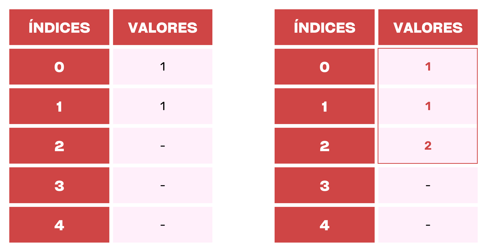
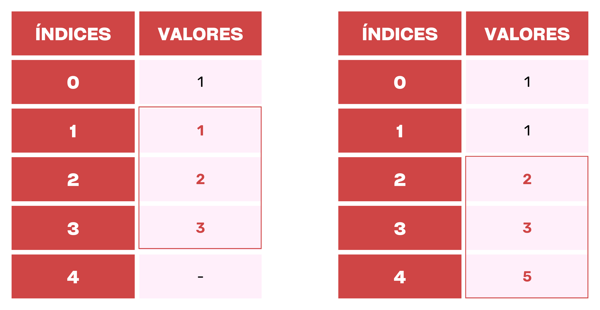
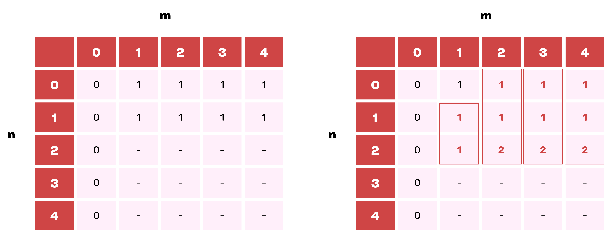
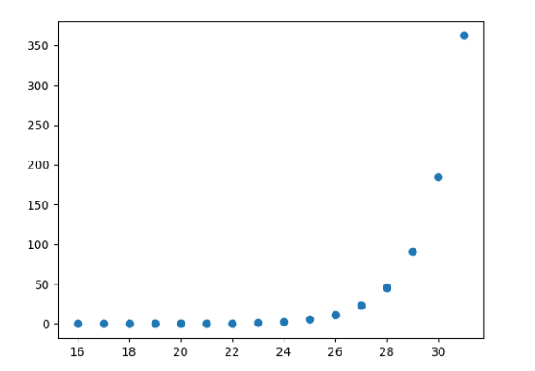
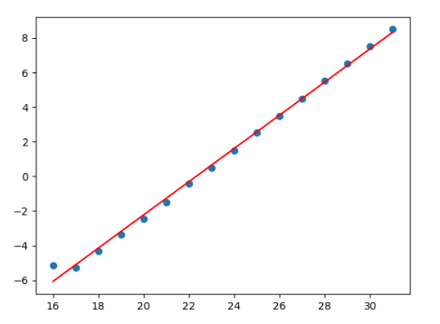
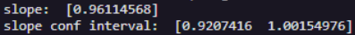

# Projeto da disciplina de PAA (Projeto e Análise de Algoritmos)

Colaboradores:
- [Guilherme dos Santos](https://github.com/Guilhermedsc)
- [Francisco Breno](https://github.com/FrBreno)
- [Pedro Neves]()

Este projeto foi criado com o intuito de enfatizar os conhecimentos adquiridos durante a disciplica. Abaixo será descrito o problema abordado e os passos que tomamos para resolvê-lo.

## Encontre maneiras totais de chegar ao nº degrau com no máximo 'm' passos

### 1. Descrição do problema

<p style="text-align: justify;">
    Dada uma escada, encontre o número total de maneiras de chegar ao n-ésimo degrau a partir da base da escada quando uma pessoa só pode subir no máximo m degraus de cada vez. Por exemplo, considere que a entrada do algoritmo seja de chegar ao quarto degrau da escada (n = 4) onde a pessoa só pode subir no máximo dois degraus de cada vez (m = 2). A saída do algoritmo será o <strong>total de maneiras</strong> de chegar ao 4° degrau com no máximo 2 degraus. Analisando o problema manualmente, temos as seguintes formas de resolver essa ocorrência: 
</p>

* 1 degrau + 1 degrau + 1 degrau + 1 degrau
* 1 degrau + 1 degrau  + 2 degraus
* 1 degrau + 2 degraus + 1 degrau
* 2 degraus + 1 degrau + 1 degrau
* 2 degraus + 2 degraus 

<p style="text-align: justify;">
    Com isso, sabemos que a saída do algoritmo retornará o valor 5, referente ao total de maneiras que o problema pode ser resolvido.
    Um segundo exemplo que podemos analisar seria o de chegar ao quarto degrau (n = 4) com no máximo quatro degraus de cada vez (m = 4). Analisando o problema manualmente, temos as seguintes maneiras de resolvê-lo:
</p>

* 1 degrau + 1 degrau + 1 degrau + 1 degrau
* 1 degrau + 1 degrau + 2 degraus
* 1 degrau + 2 degraus + 1 degrau
* 2 degraus + 1 degrau + 1 degrau
* 2 degraus + 2 degraus
* 1 degrau + 3 degraus
* 3 degraus + 1 degrau
* 4 degraus

<p style="text-align: justify;">
    Dessa forma, a saída do algoritmo retornará o valor 8, referente ao total de maneiras que o problema pode ser solucionado.Note que para o algoritmo ser executada de forma correta as entradas n e m têm que respeitar as seguintes propriedades:
</p>

* n - Um número inteiro maior ou igual a 0.
* m - Um número inteiro maior que 0.

<p style="text-align: justify;">
    Com as entradas válidas, o algoritmo retornará um número inteiro maior que 0 referente ao total de formas em que se pode chegar ao n-ésimo degrau com no máximo m degraus de cada vez. Neste resente artigo serão apresentados e analisados dois algoritmos para essa problemática que, de forma resumida, apresentam as seguintes diferenças no que tange a complexidade de tempo:
</p>

* **ALGORITMO 01:** Recursivo.
A complexidade de tempo da solução é exponencial, pois o problema exibe subproblemas sobrepostos uma vez que o algoritmo calcula soluções para os mesmos problemas repetidamente.

* **ALGORITMO 02:** Abordagem de baixo para cima, utilizando programação dinâmica.
É uma abordagem de baixo para cima onde podemos usar a tabulação para resolver esse problema de forma ascendente. A ideia principal é construir um array temporário que armazena os resultados de cada subproblema usando os resultados já computados dos subproblemas menores.

Cada algoritmo será aprofundado nos tópicos a seguir.

### 2. ALGORITMO 01 - Recursivo
<p style="text-align: justify;">
    Esse algoritmo apresenta uma versão recursiva da solução do problema, sendo executado em complexidade de tempo exponencial, uma vez que são calculadas soluções para os mesmos subproblemas repetidamente.  
</p>
A seguir temos o pseudocódigo.

```C++
totalWays(n, m) 
 
    // Entradas: Dois inteiros n e m, com n >= 0 e m > 0 que representam as escadas e os passos respectivamente.
    // Saída: Um número inteiro maior ou igual a zero que representa o total de formas que se pode chegar ao n-ésimo degrau. 

    // Caso base 1: 1 caminho (sem passos)
    se n = 0 então
      retorne 1

    count <- 0
    para i de 1 até m enquanto (n - i >= 0) faça
      count <- count + totalWays(n - i, m) // Chamada recursiva.
    fim para
   
    retorne count
```  

A função recursiva **totalWays** apresenta no seu código pré-loop o tratamento de dois casos bases:
- Caso base  
Consiste em um **if** que testa se a entrada n é um valor nulo e retorna 1. 

<p style="text-align: justify;">
    Após o tratamento dos casos bases, a função inicializa uma variável de nome <strong>count</strong> para fazer o papel de contador e inicia o loop. O loop incrementa essa variável com o retorno da chamada recursiva de <strong>totalWays</strong>, onde o valor de n é decrementado pelo valor i que vai de 1 até o número menor ou igual a m no loop, desde que (n - i) >= 0 retorne verdadeiro, uma vez que nosso algoritmo não recebe números negativos como entrada. Após o término do loop, a função retorna o valor de <strong>count</strong>.
</p>

#### 2.1. Corretude
- Especificação:
  1. Entrada dois números inteiros positivos n e m.
  1. Saída um número inteiro maior que 0.
- Invariante:
  1. Variável i que irá percorrer de 1 até m e fará a chamada recursiva receber sempre n - i, até n = 0.
- Condição de saída:
    1. Se por acaso passar pela a condição do caso base e entrar ele irá retornar um valor dentro da recursividade e fechará um galho da árvore binária.
- Estabeleça o invariante do loop:
    1. São os casos bases, se por acaso o código executar as condições do caso e não entrar dentro deles ele irá realizar o looping e se invariante.
- Finalização:
    1. Após sair do looping ele retorna o valor de count que será um número inteiro maior que zero.

#### 2.2. Exemplo de execução
<p style="text-align: justify;">
    Neste caso com algoritmo recursivo, o exemplo será demonstrado através da Árvore de Recursividade, onde através dela é possível mostrar de forma simples todas as chamadas recursivas do algoritmo. Segue a imagem abaixo:
</p>
&nbsp;
<div align="center">
    
</div>
&nbsp;

### 3. ALGORITMO 02 - Abordagem de baixo para cima  
<p style="text-align: justify;">
    Esse algoritmo utiliza tabulação para resolver o problema de forma ascendente. Para isso, um array temporário é construído para armazenar os resultados de cada subproblema usando os resultados já computados dos subproblemas menores.
</p>
<p style="text-align: justify;">
    A seguir temos o pseudocódigo.
</p>

```C++
totalWays(n, m)

// Entradas: Dois inteiros n e m, com n >= 0 e m > 0, que são as escadas e os passos respectivamente.
// Saída: Um número inteiro maior ou igual a zero que representa o total de formas que se pode chegar ao n-ésimo degrau.

     cria lookup[n + 1]     // Array temporário que armazena números inteiros

     // Caso base 1: Para alcançar o degrau 0 ou o degrau 1.
     se n >= 0 então
          lookup[0] <- 1

    // Armazenando os resultados: 
	para i de 1 até n faça
        lookup[i] <- 0
    	para j de 1 até m enquanto (i - j) >= 0 faça
        	lookup[i] <- lookup[i] + lookup[i - j]
    	fim para
	fim para

	retorne lookup[n]
```

<p style="text-align: justify;">
    A função <strong>totalWays</strong> apresenta no seu código pré-loop a criação do array temporário <strong>lookup</strong> que será utilizado para guardar a solução dos subproblemas e o tratamento de dois casos base que vão armazenar os valores dos subproblemas menores neste array. Mais detalhes são apresentados a seguir.
</p>

- Criação do array temporário
    <p style="text-align: justify;">
        O array temporário lookup consiste em uma estrutura de dados que guardará (como número do tipo inteiro) as soluções dos subproblemas gerados pelo algoritmo. A solução final desejada será armazenada no índice do n-ésimo degrau correspondente. Note que lookup é criado com n+1 posições, ou seja, seus índices abrangem a faixa de números inteiros de 0 até n.
    </p>

- Caso base 
    <p style="text-align: justify;">
        Esse caso base consiste em um if que testa se a entrada n é maior ou igual a 0. Como uma pessoa só pode executar um passo para alcançar o degrau 0, o valor 1 é atribuído a lookup[0].
    </p>
<p style="text-align: justify;">
    Ao término dessas etapas, o código entra em dois laços aninhados. No primeiro loop temos que i é inicializado em 1 e vai até o valor de n, e no segundo temos que j inicia em 1 e vai até o valor de m, sempre verificando se a expressão (i - j) >= 0 retorna true (caso contrário, o loop mais interno é interrompido).  A função geral desses laços é de associar os valores dos subproblemas ainda não solucionados aos índices correspondentes no array temporário <strong>lookup</strong>, utilizando as soluções dos subproblemas que já estão armazenadas no mesmo (note que antes dessa operação, os índices dos subproblemas ainda não solucionados recebem o valor 0). Isso é feito somando todos os valores armazenados nos m’s índices anteriores a posição i analisada naquele momento.
</p>
<p style="text-align: justify;">
    Após o término do loop, a função retorna o valor armazenado em Após o término do loop, a função retorna o valor de <strong>lookup[n]</strong>.
</p>

#### 3.1. Corretude
- Especificação:
  1. <pré_cond>: Entrada é n e m inteiros, com m > 0.
  1. <pos_cond>: Saída é um inteiro maior ou igual a zero que representa o total de formas que se pode chegar ao n-ésimo degrau.
- Invariante:
  1. Número de degraus percorridos representados por i até chegar ao n-ésimo degrau. E j é o número de passos m que se pode dar.
- Condição de saída:
  1. j até m e enquanto (i - j) >= 0
  1. i até n
- Estabeleça o invariante do loop:
  1. São os casos bases e passar vai para o loop
- Finalização:
  1. Acabou de sair do loop, o invariante é verdadeiro e a condição de saída é satisfeita. Retorna lookup[n] que satisfaz a <pos_cond>.

#### 3.2. Exemplo de execução
<p style="text-align: justify;">
    Para o algoritmo de programação dinâmica, o mesmo exemplo será representado de duas formas diferentes. A primeira mais completa e complexa em forma de tabela, e a segunda mais simples na forma de uma array.
</p>
<p style="text-align: justify;">
    Para a primeira e segunda forma teremos como entrada n = 4 e m = 2. Segue as imagens abaixo:
</p>
&nbsp;
<div align="center">
    
    
</div>
&nbsp;
<p style="text-align: justify;">
    Na primeira forma apresentada acima, primeiramente ocorre o preenchimento dos valores retornados pelo caso base. Para m > 0 e n = 0 o índice 0 do array recebe o valor 1.
</p>
<p style="text-align: justify;">
    Ao fim do preenchimento do caso base, cada posição da tabela que ainda não foi preenchida recebe a soma dos valores guardados nas m células imediatamente acima do valor procurado (respeitando o espaço alocado para o armazenamento). Por exemplo, a célula na posição [2,1] recebe o valor da célula que está imediatamente acima, ou seja, o valor da posição [1,1]. No caso da célula da posição [2,2], ela guardará o valor da soma das subsoluções armazenadas nas duas posições imediatamente acima, ou seja, [1,2] + [0,2].
</p>
&nbsp;
<div align="center">
    
    
</div>
&nbsp;
<p style="text-align: justify;">
    Na segunda forma apresentada acima,  primeiramente ocorre o preenchimento dos valores retornados pelo caso base. Para m > 0 e n = 0 o índice 0 do array recebe o valor 1.
</p>
<p style="text-align: justify;">
    Ao fim do preenchimento dos caso base, cada posição da tabela que ainda não foi preenchida recebe a soma dos valores guardados nos m índices anteriores (respeitando o espaço alocado para o armazenamento) do índice que irá receber o valor procurado.
</p>  

#### 3.3. Exemplo 02 (n = 4 e m = 4)
- Dinâmico.  
<div align="center">
    
    
    
</div>
&nbsp;

### 4. Análise Teórica

Poderão ser três casos de entrada:

I)   m = n

II)  m > n

III) m < n

<p style="text-align: justify;">
O primeiro caso será o pior caso para os dois algoritmos, tanto que no segundo caso a entrada será limitada por n já que ele irá percorrer no máximo m-n vezes, já o terceiro caso será limitado por m já que ele irá percorrer no máximo m vezes, sendo esse o menor caso.
</p>

Análise teórica da complexidade do primeiro algoritmo:
```C++
int totalWays(int n, int m)
{
if (n == 0) {  				 // O(1)
    		return 1;   		 	 // O(1)
}
int count = 0;   			 // O(1)
for (int i = 1; i <= m && (n - i) >= 0; i++) {   // O(n+1)
    	      count += totalWays(n - i, m);      // f(n-1) + f(n-2) + f(n-3) + ... + f(n-(n-1)) + O(1)
}

return count;   				 // O(1)
}
```

Portanto, teremos que a complexidade se dará por:						 
```
f(x) = O(n+1) + f(n-1) + f(n-2) + f(n-3) + ... + f(n-(m-1)) + O(n-m) + 4*O(1)
f(x) = O(n+1) + f(n-1) + f(n-2) + f(n-3) + ... + f(n-(m-1)) + O(n-m)
como no pior caso m = n, teremos que:
f(x) = O(n+1) + f(n-1) + f(n-2) + f(n-3) + ... + f(n-(n-1)) + O(1)
f(n-1) = O(n) + f(n-2) + f(n-3) + ... + f(n-(n-1)) + O(1)
f(n-2) = O(n-1) + f(n-3) + ... +f(n-(n-1)) + O(1)
f(n-3) = O(n-2) + ... + f(n-(n-1)) + O(1)
.
.
.
f(n-(n-1)) = O(n-(n-1)+1) + f(0) = O(n-(n-1)) + O(1)
 f(0) = O(1)

-> f(x) = O(n+1) + f(n-1) + f(n-2) + f(n-3) + ... + f(n-n)
    	= O(n+1) + O(n) + 2*[f(n-2) + f(n-3) + ... + f(n-n)]
    	= O(n+1) + O(n) + 2*O(n-1) + 4*O(n-2) + ... + 2^(n-1)*O(n-(n-1)) + 2^n*O(1)
    	= O[(n + n + 2*n + 4*n + ... + 2^(n-1)*(n-(n-1))) + ( 1 + 2*(-1) + 4*(-2) + ... + 2^n*1)]
    	= O[(n+1)(1 + 2*1 + 4*1 + ... + 2^n*1)]
    	= O[(n)(2^n +1)] = O(n*2^n + n) = O(2^n)

```

Recorrências de reduzir e conquistar:
```
T (n) = a · T (n − b) + f (n)
T(n)    = n*T(n-1) + f(n) 
a = n
b = 1
T(n) pertence t(n^n) = t(2^n)
f(x) = t(n^n) + t((n-1)^(n/2)) ..
T(n) pertence t(n^n) 
T(n-1) pertence t((n-1)^(n/2)) 
T(n-2) pertence t((n-2)^(n/3))
.
.
.
T(2) pertence t(2) 2^(n/(n-1) = 2^(n - n +1) = 2
T(1) pertence t(1)
T(n) = n*T(n-1) + f(n-1) 
        = n*T(n-1) + (n-1)*T(n-2) + f(n-2) 
      .
      .
T(n)    = n*T(n-1) + (n-1)T(n-2) + (n-2)*T(n-3) + … + 2*T(1) + 1*T(0)  
T(n) = 1 + 2 + 3 + … + n = (n+1)*n/2 = (n^2)/2 + n/2
b = 1
T(n) = a^(n/b) => b = 1 => teta(2^(2n))
f(x) pertence a teta(2^n)
```

Ou seja, temos que a complexidade do primeiro algoritmo será exponencial.

Análise teórica da complexidade do segundo algoritmo:

```C++
int totalWays(int n, int m)
{
  int lookup[n + 1];   				              // O(1)

  if (n >= 0) {   				     	 // O(1)
	lookup[0] = 1;   				 // O(1)
  }

  for (int i = 1; i <= n; i++) {   			 // O(n+1)
	lookup[i] = 0;   				 // O(n)
	for (int j = 1; j <= m && (i - j) >= 0; j++) {    // O((n+1)*n) 
  	     lookup[i] += lookup[i - j];   		 // O(n²) 
	}
  }

  return lookup[n];   				            // O(1)
}   
```

Portanto, teremos que:
```
f(x) = O(4) + O(n+1) + O(n) + O(n² + n) + O(n²)
f(x) = teta(2n²+3n+5)
f(x) = O(n²) = O(n * m)
```

### 5. Algoritmo Polinomial

<p style="text-align: justify;">
Supondo que n = m, vamos iniciar a nossa análise atribuindo o valor inicial 1 a estes parâmetros de entrada. Como o nosso algoritmo é polinomial vamos utilizar a razão dobrando para determinar o grau do polinômio d, da função T(n) = c * n^d.
</p>

```
 n = 256 m = 256      1.0039405592745574
 n = 512 m = 512      7.489005012768372
 n = 1024 m = 1024    4.6817017917751995
 n = 2048 m = 2048    4.773878279916807
 n = 4096 m = 4096    4.651852216008331
 n = 8192 m = 8192    5.587440225082999
 n = 16384 m = 16384  3.321876142397144
 n = 32768 m = 32768  4.129687331694931
```

<p style="text-align: justify;">
Com esses dados podemos concluir que a convergência é igual a 4, portanto o grau do polinômio é d = 2. Dessa forma podemos passar para o próximo passo e calcular o valor da constante c da função citada acima. Para isso precisamos calcular primeiro o tempo de execução de cada entrada dobrada acima.
</p>

```
 n = 256 m = 256      0.010031938552856445
 n = 512 m = 512      0.028092622756958008
 n = 1024 m = 1024    0.1264181137084961
 n = 2048 m = 2048    0.5598549842834473
 n = 4096 m = 4096    2.676727533340454
 n = 8192 m = 8192    15.863941669464111
 n = 16384 m = 16384  98.10874056816101
 n = 32768 m = 32768  564.4378845691681
```

Por padrão da função, usaremos o último valor dobrado para calcular a constante c,    n = 32768.

```
 T(N) = c * n^d
 T(32768) = c * 32768^2
 564.43 = c * 32768^2
 564.43 = c * 1.073.741.824
 c = 564.43/1.073.741.824
 c = 5,256664007902145 * 10^-7
```

<p style="text-align: justify;">
Com a constante c calculada, só basta dobrar o último valor de entrada para acharmos o valor que queremos fazer a previsão do tempo de execução.
</p>

```
 n = 65536 m = 65536  3463.9970002174377
```

Agora iremos fazer a previsão do tempo de execução para n = 65536.

```
 T(N) = c * n^d
 T(65536) = 5,256664007902145 * 10^-7 * 65536^2
 T(65536) = 5,256664007902145 * 10^-7 * 4.294.967.296
 T(65536) = 5,256664007902145 * 429,4967296
 T(65536) = 2257,72 = 2257,72 segundos
```

Com a previsão do tempo de execução de n = 65536 feita, podemos calcular a diferença relativa/percentual do tempo previsto para o tempo real do mesmo.

```
 diferença_relativa = 100 * |tempo_medido - tempo_previsto|/tempo_previsto
 diferença_relativa = 100 * |2257,72 - 3463,9970002174377|/3463,9970002174377
 diferença_relativa = 100 * |1206,2770002174377|/3463,9970002174377
 diferença_relativa = 100 * 1206,2770002174377/3463,9970002174377
 diferença_relativa = 100 * 0,348232691928347
 diferença_relativa = 34,82%
```

Assim temos que a diferença relativa entre os dois tempos é de 34,82%.

### 6. Algoritmo Recursivo

#### 6.1. Tempos de execução em função do tamanho da entrada

<p style="text-align: justify;">
Supondo que n = m, vamos iniciar a nossa análise atribuindo o valor inicial 1 a estes parâmetros de entrada. Nossa hipótese é que o algoritmo executa em tempo exponencial, T(n) = c * b^n, onde b = 2 e c uma constante que será determinada mais adiante.
</p>

<p style="text-align: justify;">
Na caixa de texto abaixo temos os tempos de execução (em segundo) obtidos em função do tamanho da entrada com n e m iniciado em 1, e incrementando em uma unidade a cada interação. Lembrando que neste teste, a execução foi interrompida quando o tempo de execução ultrapassou 5 minutos (300 segundos).
</p>

```n = 1  m = 1    0.0
n = 2  m = 2    0.0
n = 3  m = 3    0.0
n = 4  m = 4    0.0
n = 5  m = 5    0.0
n = 6  m = 6    0.0
n = 7  m = 7    0.0
n = 8  m = 8    0.0
n = 9  m = 9    0.0
n = 10  m = 10  0.0
n = 11  m = 11  0.0
n = 12  m = 12  0.0
n = 13  m = 13  0.0
n = 14  m = 14  0.0
n = 15  m = 15  0.0
n = 16  m = 16  0.028016090393066406
n = 17  m = 17  0.02600836753845215
n = 18  m = 18  0.0500025749206543
n = 19  m = 19  0.09770631790161133
n = 20  m = 20  0.1816096305847168
n = 21  m = 21  0.3535780906677246
n = 22  m = 22  0.7581017017364502
n = 23  m = 23  1.4254002571105957
n = 24  m = 24  2.851003646850586
n = 25  m = 25  5.703202486038208
n = 26  m = 26  11.333600282669067
n = 27  m = 27  22.684242725372314
n = 28  m = 28  45.361992597579956
n = 29  m = 29  90.78612351417542
n = 30  m = 30  185.28641533851624
n = 31  m = 31  362.3291726112366
```

#### 6.2. Gráficos e valor do Slope

<p style="text-align: justify;">
A partir dos resultados obtidos, vamos plotar o gráfico de T(n) em função de n para visualizarmos a curva da função exponencial, desconsiderando as entradas em que o tempo de execução foi igual a 0.
</p>
&nbsp;
<div align="center">
    
</div>
&nbsp;
<p style="text-align: justify;">
Em seguida, como achamos que nosso algoritmo executa em tempo exponencial, plotamos o gráfico de lg T(n) em função de n e obtivemos o slope, que será utilizado para determinar o valor de b.
</p>
&nbsp;
<div align="center">
    
</div>
&nbsp;
<div align="center">
    
</div>
&nbsp;
<p style="text-align: justify;">
Levando em conta o intervalo de confiança, vamos aproximar o valor do nosso slope para 1. Dessa forma, utilizamos a fórmula da inclinação da reta a * lg b = slope para calcularmos o valor de b.
</p>

```
Assumindo que a = 1, temos que:

1 * lg b = 1
2^1 = b
b = 2
```

Substituindo o valor de b na fórmula de T(n), temos que T(n) = c * 2^n.

#### 6.3. Determinando o valor da constante C

O próximo passo é determinar o valor de c utilizando o resultado obtido pelo teste quando n = 31.

```
T(n) = c * 2^n

T(31) = c * 2^31
362,3292 = c * 2.147.483.648
c = 3.623.292 * 10^(-4) / 2.147.483.648
c = 0,0016872268*10^(-4)

c ≅ 1.687,2268 * 10^(-10)
```

Com isso, temos que T(n) = 1.687,2268 * 10^(-10) * 2^n.

#### 6.4. Previsão do tempo de execução para n = 32

Vamos aplicar a função T(n) na entrada de tamanho 32 (n  = 32):

```
T(n) = 1.687,2268 * 10^(-10) * 2^n

T(32) = 1.687,2268 * 10^(-10) * 2^32
T(32) = 1.687,2268 * 10^(-10) * 4.294.967.296
T(32) = 7.246.583.926.934,7328 * 10^(-10)
T(32) ≅  724,6584 segundos
```

A seguir temos o valor do tempo de execução obtido pelo algoritmo com as entradas n e m iguais a 32.
&nbsp;
<div align="center"> 
    
</div>
&nbsp;
#### 6.5. Diferença percentual entre o valor previsto e o valor medido

```
Diferenca_Relativa = 100 * (|724,7886 - 724,6584| / 724,6584) %
                   = 100 * (0,1302 / 724,6584) %
                   = 100 * (0,1302 / 724,6584) % 
                   = 100 * 0,00017967086285068937308944462659924 %
                   = 0,017967086285068937308944462659924 %
Diferenca_Relativa ≅  0,018 %
```

### 7. Comparação entre complexidades empíricas e teóricas

```
Complexidade empírica: 
    polinomial:  T(n) = c * n^2
    exponencial: T(n) = c * 2^n	

Complexidade teórica:
    polinomial:  T(n) = O(n^2)
    exponencial: T(n) = O(2^n)