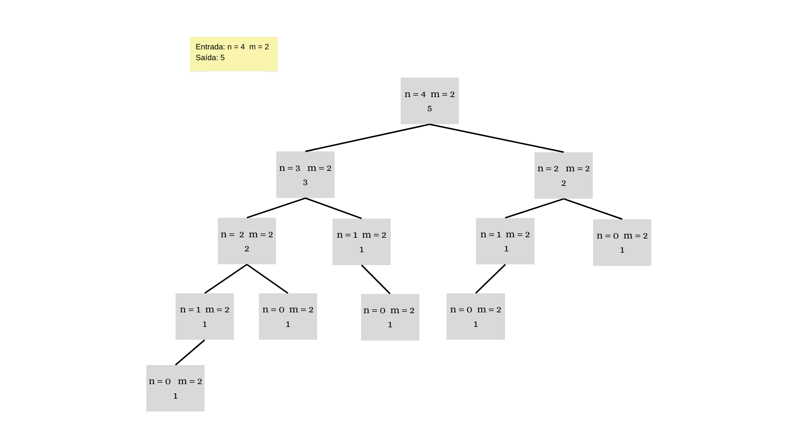

# Projeto da disciplina de PAA (Projeto e Análise de Algoritmos)

Este projeto foi criado com o intuito de enfatizar os conhecimentos adquiridos durante a disciplica. Abaixo será descrito o problema abordado e os passos que tomamos para resolvê-lo.

## Encontre maneiras totais de chegar ao nº degrau com no máximo 'm' passos

### 1. Descrição do problema

Dada uma escada, encontre o número total de maneiras de chegar ao n-ésimo degrau a partir da base da escada quando uma pessoa só pode subir no máximo m degraus de cada vez. Por exemplo, considere que a entrada do algoritmo seja de chegar ao quarto degrau da escada (n = 4) onde a pessoa só pode subir no máximo dois degraus de cada vez (m = 2). A saída do algoritmo será o **total de maneiras** de chegar ao 4° degrau com no máximo 2 degraus. Analisando o problema manualmente, temos as seguintes formas de resolver essa ocorrência: 

* 1 degrau + 1 degrau + 1 degrau + 1 degrau
* 1 degrau + 1 degrau  + 2 degraus
* 1 degrau + 2 degraus + 1 degrau
* 2 degraus + 1 degrau + 1 degrau
* 2 degraus + 2 degraus 

Com isso, sabemos que a saída do algoritmo retornará o valor 5, referente ao total de maneiras que o problema pode ser resolvido.
Um segundo exemplo que podemos analisar seria o de chegar ao quarto degrau (n = 4) com no máximo quatro degraus de cada vez (m = 4). Analisando o problema manualmente, temos as seguintes maneiras de resolvê-lo:

* 1 degrau + 1 degrau + 1 degrau + 1 degrau
* 1 degrau + 1 degrau + 2 degraus
* 1 degrau + 2 degraus + 1 degrau
* 2 degraus + 1 degrau + 1 degrau
* 2 degraus + 2 degraus
* 1 degrau + 3 degraus
* 3 degraus + 1 degrau
* 4 degraus

Dessa forma, a saída do algoritmo retornará o valor 8, referente ao total de maneiras que o problema pode ser solucionado.Note que para o algoritmo ser executada de forma correta as entradas n e m têm que respeitar as seguintes propriedades:

* n - Um número inteiro maior ou igual a 0.
* m - Um número inteiro maior que 0.

Com as entradas válidas, o algoritmo retornará um número inteiro maior que 0 referente ao total de formas em que se pode chegar ao n-ésimo degrau com no máximo m degraus de cada vez. Neste resente artigo serão apresentados e analisados dois algoritmos para essa problemática que, de forma resumida, apresentam as seguintes diferenças no que tange a complexidade de tempo:

* **ALGORITMO 01:** Recursivo.
A complexidade de tempo da solução é exponencial, pois o problema exibe subproblemas sobrepostos uma vez que o algoritmo calcula soluções para os mesmos problemas repetidamente.

* **ALGORITMO 02:** Abordagem de baixo para cima, utilizando programação dinâmica.
É uma abordagem de baixo para cima onde podemos usar a tabulação para resolver esse problema de forma ascendente. A ideia principal é construir um array temporário que armazena os resultados de cada subproblema usando os resultados já computados dos subproblemas menores.

Cada algoritmo será aprofundado nos tópicos a seguir.

### 2.2 - Exemplo de execução
Neste caso com algoritmo recursivo, o exemplo será demonstrado através da Árvore de Recursividade, onde através dela é possível mostrar de forma simples todas as chamadas recursivas do algoritmo. Segue a imagem abaixo:

